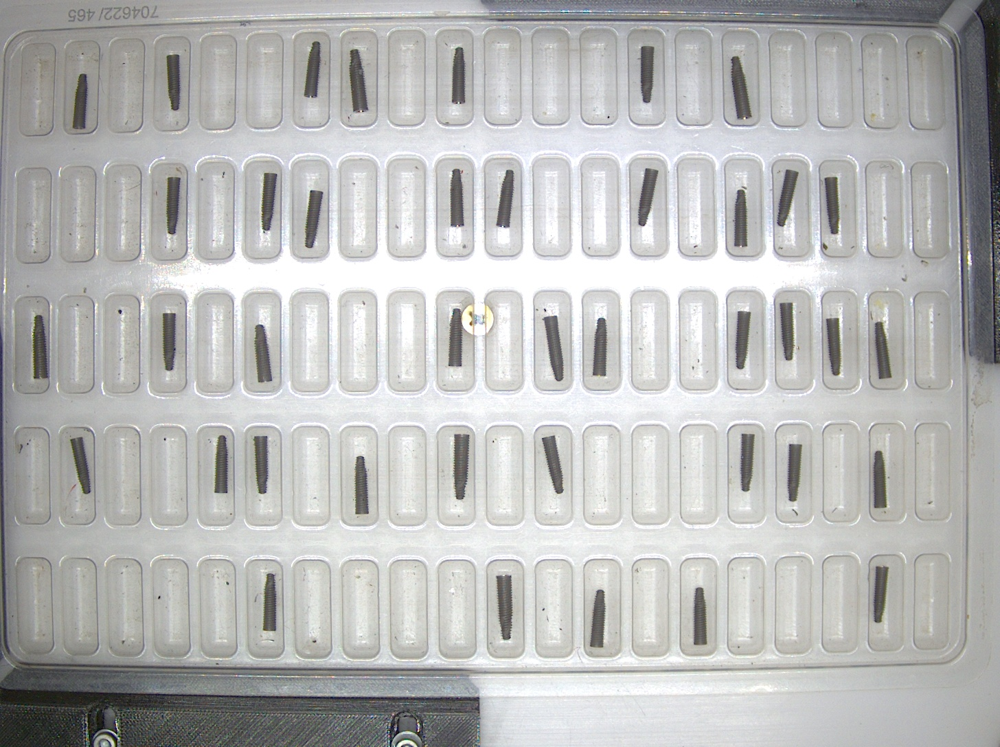
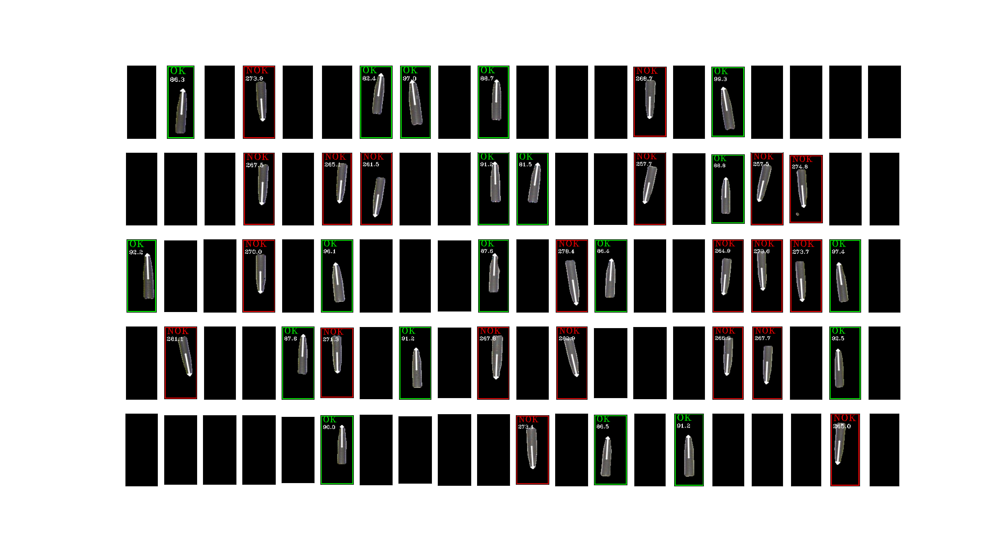

# KerasValidador - Transbordo

Utiliza modelos customizados de CNN para identificar presença e orientação dos itens presentes nos blister da mesa de transbordo.
Angulação, centro, e área são calculados apartir do contorno dos objetos.


## Execução:

```shell
python .\detect.py -P "./docs/asset/frame.jpg" -S 20
```




## Instalação

**Crie um ambiente isolado:**

```bash
  python -m venv env
```

**Unix**
```bash
source ./env/bin/activate
```

**Windows**
```bash
 ./env/bin/activate
```

**Instale as dependências**
```bash
pip install -r requirements.txt
```
## Criando um novo modelo

Garanta a seguinte extrutura de pastas:

```bash

└───models
    ├───orientation
    │   ├───test
    │   │   ├───nok
    │   │   └───ok
    │   └───train
    │       ├───nok
    │       └───ok
    └───presence
        ├───test
        │   ├───nok
        │   └───ok
        └───train
            ├───nok
            └───ok

```

As imagens de treinamento em
```<model_name>/train/<x.jpg>``` devem ser unicas e diferentes das presentes no diretório de validação em ```<model_name>/train/<x.jpg>```.


Crie um novo modelo utilizando o modulo ``` cnn.py ```. Substititua *<model_name>* pelo nome do diretorio do modelo a ser criado:

```bash
python .\cnn.py -CM True -CKP "./model/models/<model_name>/" -TD "./model/models/<model_name>/train" -VD "./model/models/<model_name>/test"
```
